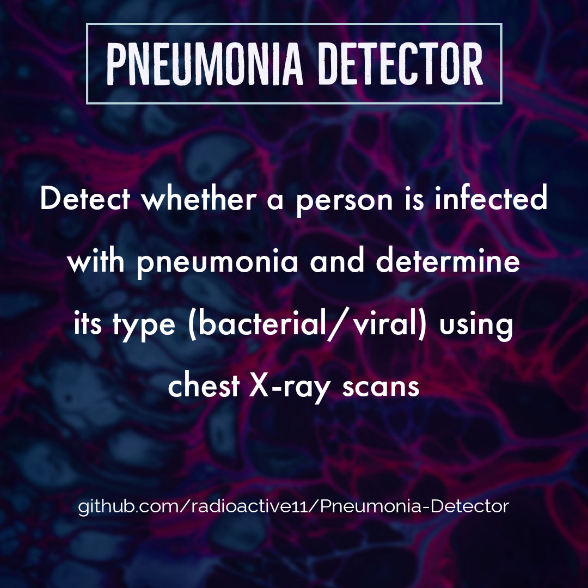

[![Contributors][contributors-shield]][contributors-url] 
[![Forks][forks-shield]][forks-url]
[![Stargazers][stars-shield]][stars-url]
[![Issues][issues-shield]][issues-url]
[![MIT License][license-shield]][license-url]
[![LinkedIn][linkedin-shield]][linkedin-url]


<!-- PROJECT LOGO -->
<br />
<p align="center">
  <a href="https://github.com/radioactive11/Pneumonia-Classifier">
    
  </a>

  <h2 align="center">Pneumonia Detector</h>

  <h4 align="center">
  <p align="center">
    Classifies type of pneumonia using X-ray scans & Deep Learning
    </h4>
  </p>
</p>


<!-- TABLE OF CONTENTS -->
## Table of Contents

- [Table of Contents](#table-of-contents)
- [About The Project](#about-the-project)
- [Built With](#built-with)
- [Getting Started](#getting-started)
  - [Installation](#installation)
- [Usage](#usage)
- [Product Screenshot](#product-screenshot)
- [Roadmap](#roadmap)
- [Contributing](#contributing)
- [License](#license)
- [Contact](#contact)


<!-- ABOUT THE PROJECT -->
## About The Project


Pneumonia Classifier uses Deep Learning to classify X-Ray chest images to classify whether a person is infected with Pneumonia. Further it also can classify the type of infection i.e. whether the infection is viral or bacterial. </br>

The model was trained using [this](https://www.kaggle.com/paultimothymooney/chest-xray-pneumonia) dataset from [Kaggle](https://www.kaggle.com/)

I used the [OIDv4 Tool Kit](https://github.com/Francisobiagwu/OIDv4_ToolKit) to fetch the images along with thier labels.


## Built With

* [Python](https://www.python.org/)
* [TensorFlow2](https://www.tensorflow.org/)
* [Keras](https://keras.io)


<!-- GETTING STARTED -->
## Getting Started

This application is targetted for windows and will work on other operating systems with some slight modifications. 
You will need:

- Python (>=3.6)
- Tensorflow(>=2.3)

To get a local copy up and running follow these simple example steps.


### Installation

1. Make sure you have python3 setup on your system
2. Clone the repo
```sh
git clone https://github.com/radioactive11/Pneumonia-Classifier
```
3. Install requirements
```sh
pip install -r requirements.txt
```
4. Save test images to *```images/```*

5. Open terminal and enter
```
python3 pneumonia.py
```
6. Enter name of image (including extension)

<!-- USAGE EXAMPLES -->
## Usage

This application can be used to

- Detect if a person is infected with pneumonia
- Detect the type of infection - viral/bacterial
  
  This application cannot replace the expertise of a trained medical practitioner. However it can ease thier workload if the X-Ray results are classified and are sent to them just for final verification.

## Product Screenshot

![product-screenshot1]


<!-- ROADMAP -->
## Roadmap

See the [open issues](https://github.com/radioactive11/Pneumonia-Classifier/issues) for a list of proposed features (and known issues).


<!-- CONTRIBUTING -->
## Contributing

Contributions are what make the open source community such an amazing place to be learn, inspire, and create. Any contributions you make are **greatly appreciated**.

1. Fork the Project
2. Create your Feature Branch (`git checkout -b feature/AmazingFeature`)
3. Commit your Changes (`git commit -m 'Add some AmazingFeature'`)
4. Push to the Branch (`git push origin feature/AmazingFeature`)
5. Open a Pull Request


<!-- LICENSE -->
## License

Distributed under the MIT License. See `LICENSE` for more information.


<!-- CONTACT -->
## Contact

Arijit Roy - [@this_is_radioactive11](https://www.instagram.com/this_is_radioactive11/) <br />
Project Link: [https://github.com/radioactive11/Pneumonia-Classifier](https://github.com/radioactive11/Pneumonia-Classifier)


<p align="center"> Made with :blue_heart: for India

[contributors-shield]: https://img.shields.io/github/contributors/radioactive11/ALPR-India.svg?style=flat-square
[contributors-url]: https://github.com/radioactive11/Pneumonia-Classifier/graphs/contributors
[forks-shield]: https://img.shields.io/github/forks/radioactive11/ALPR-India.svg?style=flat-square
[forks-url]: https://github.com/radioactive11/Pneumonia-Classifier/network/members
[stars-shield]: https://img.shields.io/github/stars/radioactive11/ALPR-India.svg?style=flat-square
[stars-url]: https://github.com/radioactive11/Pneumonia-Classifier/stargazers
[issues-shield]: https://img.shields.io/github/issues/radioactive11/ALPR-India.svg?style=flat-square
[issues-url]: https://github.com/radioactive11/Pneumonia-Classifier/issues
[license-shield]: https://img.shields.io/github/license/radioactive11/ALPR-India.svg?style=flat-square
[license-url]: https://github.com/radioactive11/Pneumonia-Classifier/blob/master/LICENSE.txt
[linkedin-shield]: https://img.shields.io/badge/-LinkedIn-black.svg?style=flat-square&logo=linkedin&colorB=555
[linkedin-url]: https://linkedin.com/in/arijit--roy
[product-screenshot1]: media/sample.gif
[product-post]: media/post.png